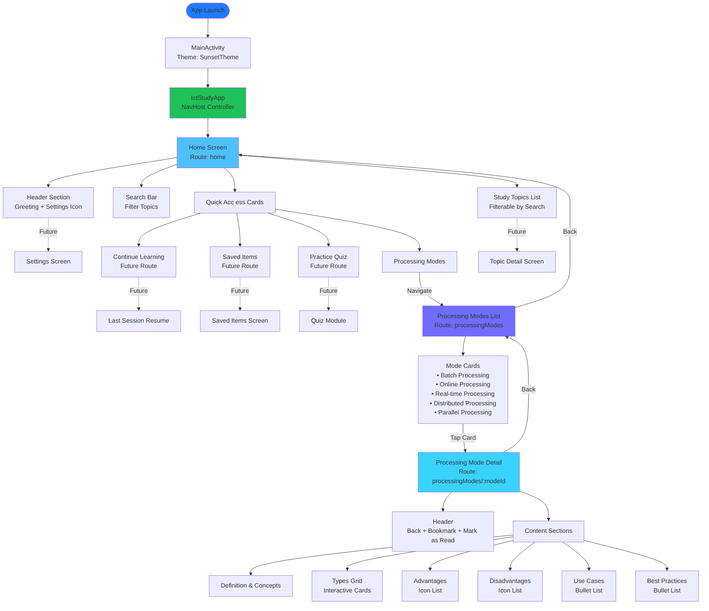
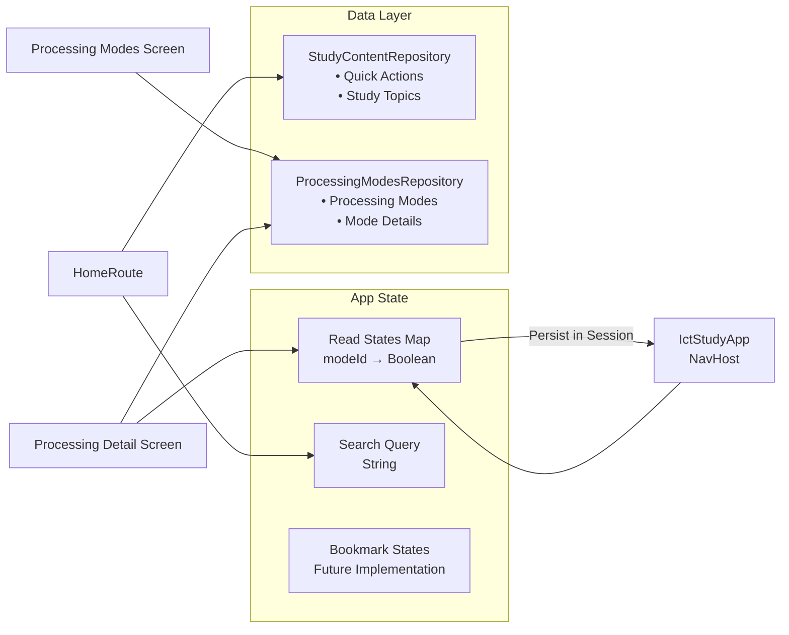
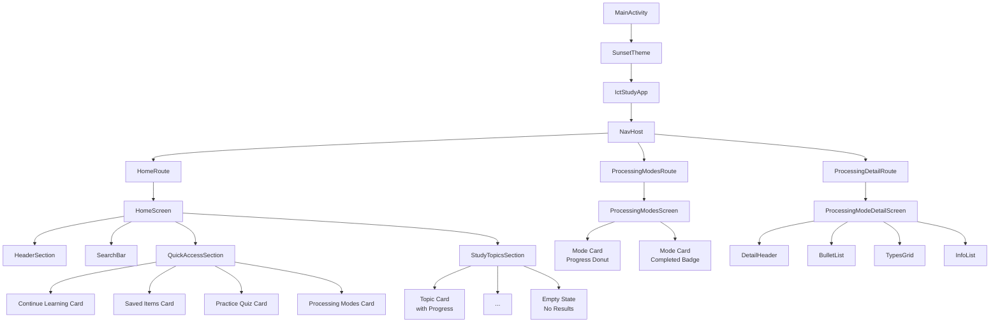
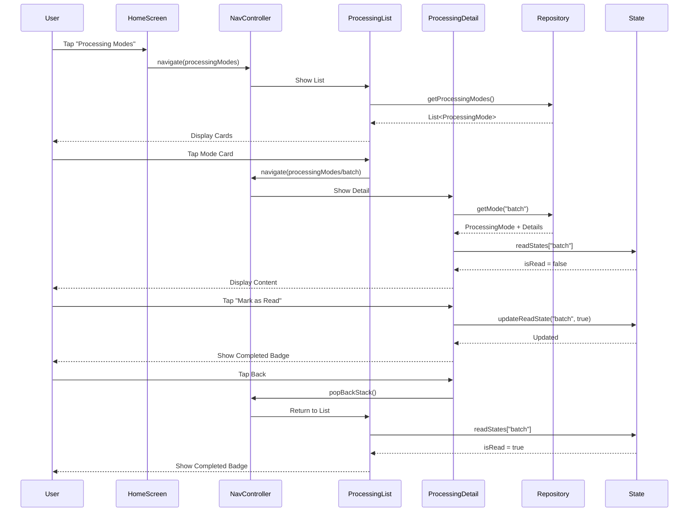
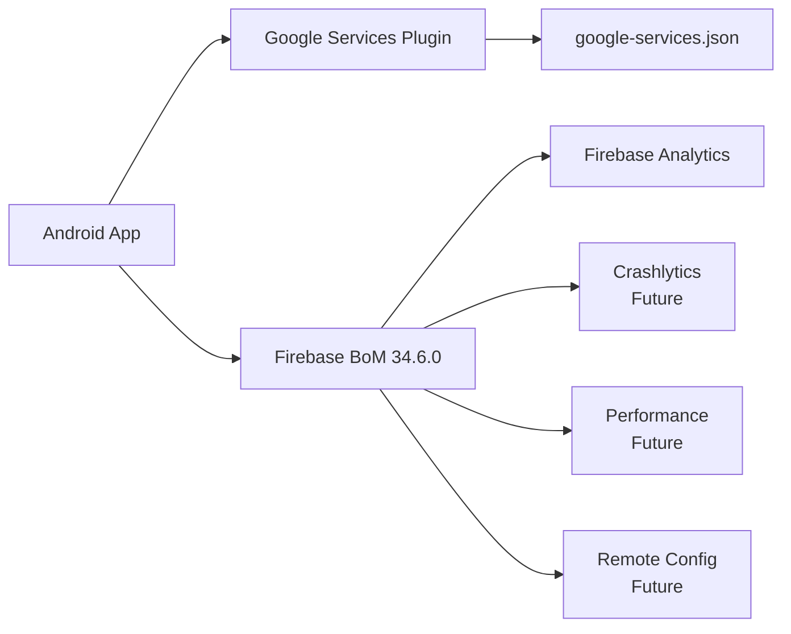
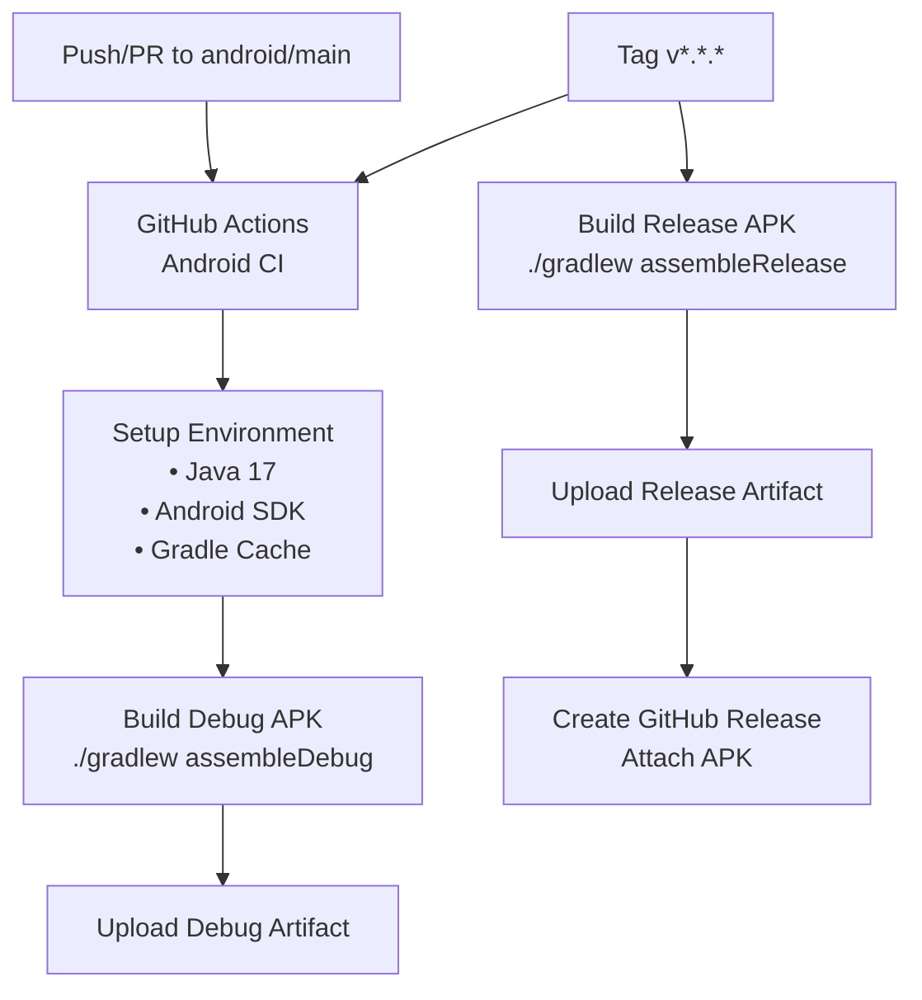

# ICT Revision Hub - App Design Flow Chart

## Architecture Overview

The ICT Revision Hub is a native Android app built with Kotlin and Jetpack Compose, following a single-activity architecture with Compose Navigation.

## Navigation Flow Chart

## State Management

## UI Component Hierarchy

## Data Flow

## Theme & Styling

- **Color Palette**: Dark theme with gradient accents
  - `NightSurface`: `#060C1A`
  - `NightCard`: `#121C2F`
  - `AccentPrimary`: `#1F7BFF`
  - `AccentCyan`: `#4FC0FF`
  - `AccentPurple`: `#706CFF`
  
- **Typography**: Material 3 default type scale
- **Icons**: Material Icons Rounded Extended
- **Shapes**: RoundedCornerShape (14-28dp radius)
- **Gradients**: Linear gradients for cards and backgrounds

## Firebase Integration

## Build & CI/CD

## Future Enhancements

1. **Topic Detail Screens**: Comprehensive topic exploration with lessons and quizzes
2. **Saved Items**: Bookmark and organize favorite topics
3. **Practice Quizzes**: Interactive quiz module with progress tracking
4. **Settings**: Theme customization, analytics opt-in, notification preferences
5. **Offline Support**: Local database with Room for offline access
6. **Search Enhancement**: Full-text search across all content
7. **Progress Sync**: Cloud sync with Firebase Firestore
8. **Gamification**: Achievements, streaks, and leaderboards
